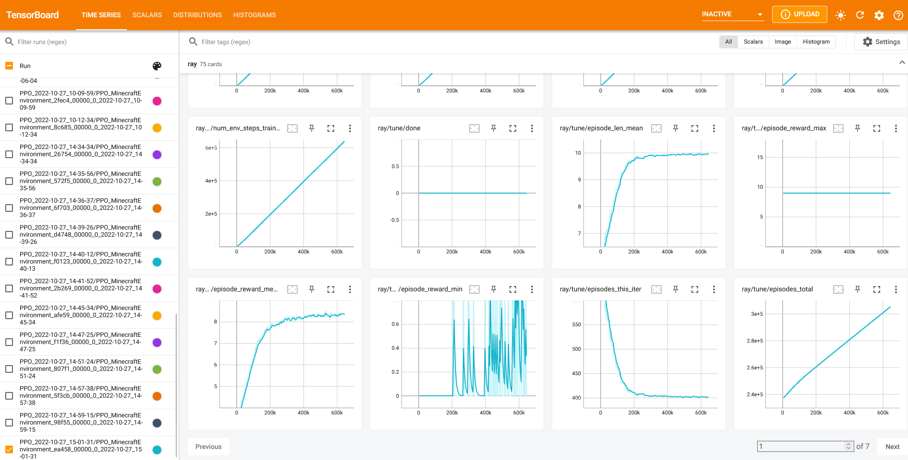
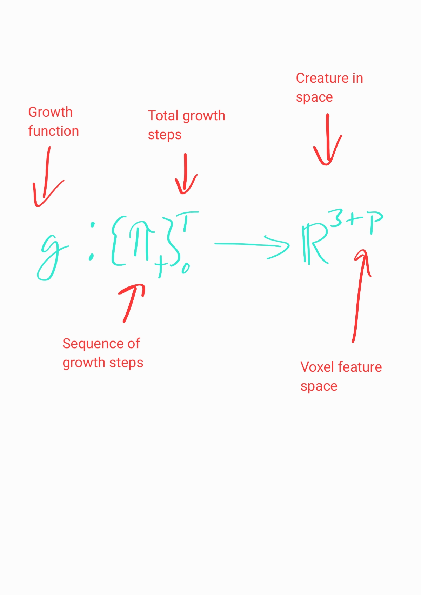
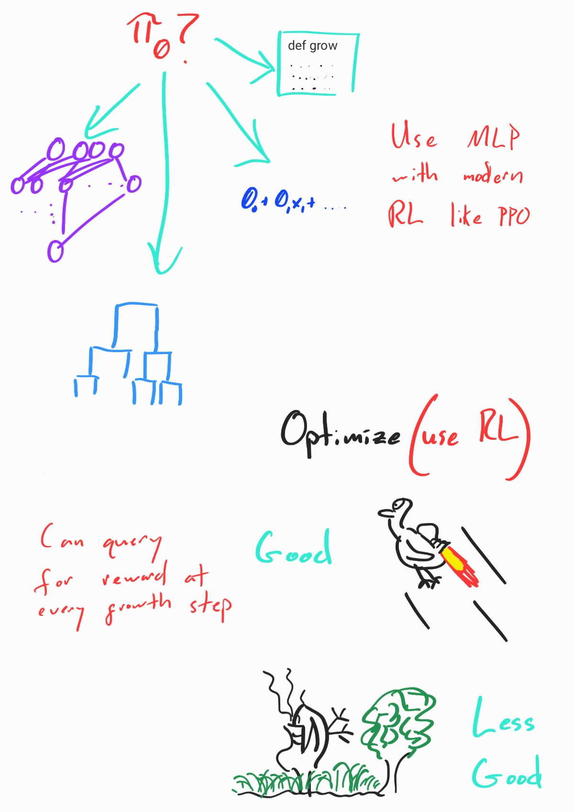

# Growing Virtual Creatures in Minecraft

https://user-images.githubusercontent.com/869178/201533053-27c2ff53-e625-40ed-a490-5cd401896609.mp4

*Sea lanterns searching for glowstone*

[](https://travis-ci.com/cfusting/conditional-growth)

## Motivation

Growing virtual creatures is really fun [1]. However optimizing them in a physics engine in three dimensions is (as of 2022) pretty time consuming even on a powerful desktop computer. Science is limited by creativity, technical expertise, and cycles. To adress the later, this package includes a psuedo-realistic environment: Minecraft [2], to enable anyone with a farily modern computer to grow virtual creatures for fun and perhaps, to test hypothesizes.

Minecraft is a very good looking gridworld with a few noteable advantages:
- Some blocks, like sand and water, respond to physics.
- The world is procedurally generated, providng an endless landscape of random environments.
- Multi-agent environments are supported by default.

So, although the curious individual may not be able to simulate a robot to be transferred to our world, a great deal can be explored and tested.

A primary goal of this package is to be standardized, extendible, and modular: many of the code bases I have come across couple a growth encoding with an optimization algorithm, limiting their application and testability. To that end the growth function and Ray's RLlib are completely independent; tied together only in the minecraft environment class following Open AI's Gym standard. You can replace the growth function with anything that returns an encoding you can convert to blocks (I'd like to see Compositional Pattern Producing Networks [3], for example) and write your own environment. In the same vein Ray gives you a robust selection of gradient and non-gradient based optimization algorithms to choose from, the ability to scale, and standardized logging and experiment tracking with [MLFlow](https://mlflow.org/) and [Tensorboard](https://www.tensorflow.org/tensorboard).

My hope is that this package enables any company, university, and especially **individual** to implement one, two, or all of a:

- Growth encoding
- Environment
- Optimizer

to test hypothesizes or just mess around, with something that will work on a standard desktop but can be scalled to a high performance computing cluster.

glhf.

## Core Components

Roughly speaking, there are three things that tie this package together.
1. The minecraft server.
2. A minecraft environment which extends OpenAI's Gym [Environment](https://github.com/openai/gym/blob/6a04d49722724677610e36c1f92908e72f51da0c/gym/core.py) and makes use of a growth function (custom to this package) to decide what to grow.
3. [Ray's RLlib](https://docs.ray.io/en/latest/rllib/index.html) for scalable optimization and logging.

### Tracking and Metrics 

Metrics are captured by the Ray in /tmp/expname where expname is specified in the run configuartion in the run function by the paramater "name". You'll need to spend some time learning the Ray framework to become comfortable with this and other parameter choices governing the optimization process. The easiest way to view the metrics is to use tensorboard and will be described in the example below. Here's a pretty picture:



## Theory of the conditional growth function

I've summarized the idea of the conditional growth function in a few images below. The idea is as follow:

The growth of a creature can be broken down into an ordered sequence of steps. At each step, the optimizer has access to a state describing the creature and / or environment. Using this information a configuration of voxels is chosen (for example, by selecting the voxel configuration with the maximum probability) to be added to the current growing voxel. Voxels are stored in a queue and are thus grown on breadth-first.

The above process boils down to the breadth-first application of the conditional probability of a voxel configuration given a state. Thus the beadth-first voxel selection process coupled with the growth function results in a creature of potentially infinite voxels: the integral of the growth function over time and space. My hope is that self-repeating structures will be observed and built by the growth function, providing a genommic encoding which can be thought of as a compressed representation of a creature.


|||
   
## Example: Get the block

https://user-images.githubusercontent.com/869178/201533091-b17d37d1-df6c-46de-b8d5-ef18f670fe3f.mp4

*Navigating obstacles*

In this example we will grow a creature out of sea lanterns (reason: they look cool) who's goal is to touch a reward block. At each growth step the probability of a voxel configuration is determined given the tensor convolution of block types within some one norm k neighborhood of the block on which the configuration is to be added (translation: limited vision). To get this example running you will need docker and linux (Windows Subsytem 2 is fine).

Note: It would be fair to ask at this point if the creature is "growing" or "reaching" toward the reward block. As it turns out, it doesn't matter, because this is Minecraft.

### Docker Requirements
If you would like to use a GPU make sure to install [nvidia-container-runtime](https://stackoverflow.com/questions/59691207/docker-build-with-nvidia-runtime). Other than that the Dockerfile will handle all the dependencies.

### Installing Nvidia container runtime

```bash
distribution=$(. /etc/os-release;echo $ID$VERSION_ID) \
   && curl -s -L https://nvidia.github.io/nvidia-docker/gpgkey | sudo apt-key add - \
   && curl -s -L https://nvidia.github.io/nvidia-docker/$distribution/nvidia-docker.list | sudo tee /etc/apt/sources.list.d/nvidia-docker.list
   
sudo apt-get update && sudo apt-get install -y nvidia-docker2
sudo systemctl restart docker
```

### Running
Navigate into this repo's root directory and build the image and name it "growth":

```bash
docker build -t growth .
```

Build the minecraft server by navigating into the minecraft-server directory:

```bash
docker build -t mc .
```

Start it in a seperate terminal and expose the RPC and general server ports:

```bash
docker run -it --rm -p 5001:5001 -p 25565:25565 mc
```

Start the tensorboard server. When we run the optimizer we will map /tmp to the experiment and as such are drawing the logs from that directory in the following command. You can launch tensorboard in a web browser with localhost:6006. You'll need to pull the tensorboard/tensorboard image prior to this step:

```bash
docker run -p 6006:6006 --rm -v /tmp:/tmp tensorflow/tensorflow tensorboard --logdir /tmp --host 0.0.0.0 --port 6006
```

Run the optimizer:

```bash
docker run -it --rm --gpus all -v /tmp:/home/ray/ray_results --network host growth python run_configurations/minecraft/run.py
```

## References
[1] Kriegman, Sam. "Why virtual creatures matter." Nature Machine Intelligence 1.10 (2019): 492-492.

[2] Grbic, Djordje, et al. "EvoCraft: A new challenge for open-endedness." International Conference on the Applications of Evolutionary Computation (Part of EvoStar). Springer, Cham, 2021.

[3] Stanley, Kenneth O. "Compositional pattern producing networks: A novel abstraction of development." Genetic programming and evolvable machines 8.2 (2007): 131-162. 
