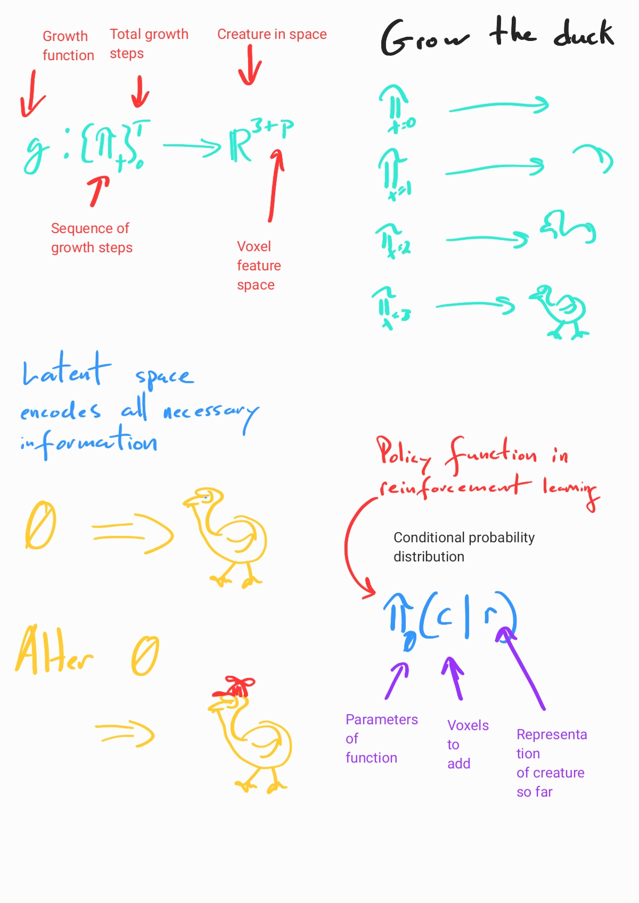

# Growing Virtual Creatures

[](https://travis-ci.com/cfusting/conditional-growth)

### About

This package provides the necessary tooling to grow virtual creatures made from three-dimensional blocks called voxels (3d pixels). Starting with one or more voxels new voxels are iteratively added based on the composition of nearby voxels and the current position. In the simulation environment some voxels are energetic and pulse, causing the virtual creatures to move around.

### Theory




### Building with Docker

#### Requirements
This project uses [voxcraft-sim](https://github.com/voxcraft/voxcraft-sim) to simulate voxels. When building voxcraft-sim the makefile checks if a GPU is available. Thus it is necessary for docker build to be able to see your GPU. To that end install and configure the [nvidia-container-runtime](https://stackoverflow.com/questions/59691207/docker-build-with-nvidia-runtime).

#### Installing the Nvidia runtime

```bash
distribution=$(. /etc/os-release;echo $ID$VERSION_ID) \
   && curl -s -L https://nvidia.github.io/nvidia-docker/gpgkey | sudo apt-key add - \
   && curl -s -L https://nvidia.github.io/nvidia-docker/$distribution/nvidia-docker.list | sudo tee /etc/apt/sources.list.d/nvidia-docker.list
   
sudo apt-get update && sudo apt-get install -y nvidia-docker2
sudo systemctl restart docker
```

#### Build

Clone this repository and navigate into the root folder.

```bash
docker build -t grow .
```

### Optimizing a Creature

In this example we will build a creature for which surface area is maximized and volume is minimized.

#### Run

Run the optimization script, storing the results in the host environment's /tmp directory.

```bash
docker run --rm --gpus all -v /tmp:/tmp --shm-size 2G grow python scripts/grow/optimize_grid.py
```

#### Metrics

Metrics are captured by the [ray](https://docs.ray.io/en/master/) framework in /tmp/ray_results/expname where expname is specified in the optimize_grid.py script. The easiest way to view the metrics is to use tensorboard. For example:

```bash
tensorboard --logdir /tmp/ray_results/badger
```


#### Creatures

Uncommenting `monitor=True` in optimize_grid.py will enable the recording of a creature being built. The resulting movies can be found in /tmp/ray_results/expname/trialname (as can all the other logs). Refer to [RLlib](https://docs.ray.io/en/master/rllib.html) for more details. 

Due to a memory leak in vtk (which is the graphics library used to create the movies), enabling monitoring will eventually cause the trial to crash. To avoid this run your experiment until convergence and turn on monitoring after loading a checkpoint to capture a few movies at that point in training.

Below are some videos of this example mid-way through training and at convergence.


### Running on an HPC

Most clusters do not allow non-root users to use privileged tools like Docker. [Singularity](https://sylabs.io/singularity/), however, can be used in a similar if slightly less convenient manner. Because some actions that singularity must take require root privileges, a pre-built image is provided. The image is updated automatically when the main branch of this project changes, but feel free to raise an issue if it seems out of date.

#### Prepare

Get on to a node on your cluster where you can download and test the image. You'll probably need to load a recent version of Singularity:

```bash
module load Singularity/3.6.1
```

#### Pull

Pull the image to the cluster:

```bash
singularity pull shub://cfusting/conditional-growth
```

#### Run

You can now run the above example similarly:

```bash
singularity exec --writable-tmpfs shub://cfusting/conditional-growth python /root/conditional-growth/experiments/grow/optimize_grid.py
```

#### Caveats

Singularity containers are read-only which can cause issues if you wish to make changes to (for example) the experiments configurations in optimize_grid.py. One simple solution is to enter the container interactively, copy the conditional-growth repository into your home folder, (which the container can see) and run experiments from there:

```bash
cd ~
singularity shell --writable-tmpfs shub://cfusting/conditional-growth
cp -R /root/conditional-growth .
exit
singularity exec --writable-tmpfs shub://cfusting/conditional-growth python ~/conditional-growth/experiments/grow/optimize_grid.py
```

You could of course remain within the shell and run from there.
